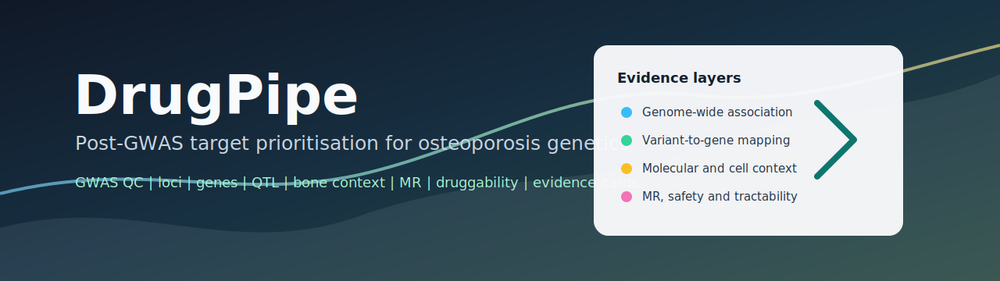
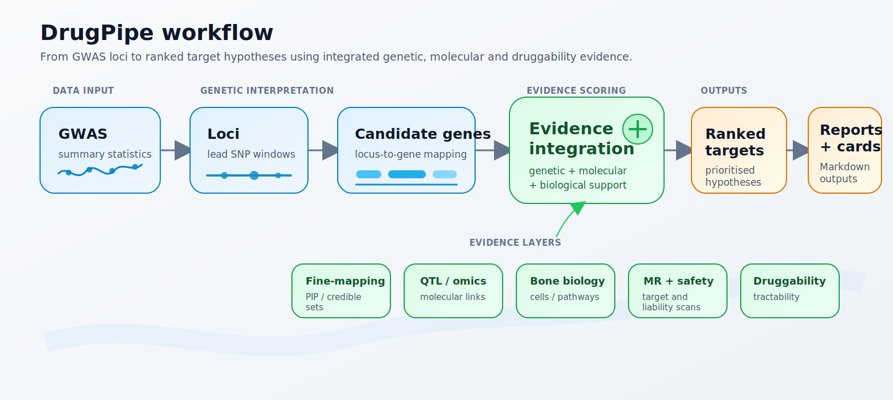

# DrugPipe



[](https://github.com/kaiyao28/DrugPipe/actions/workflows/tests.yml)


DrugPipe is a lightweight local-file pipeline and reference code library for
post-GWAS target prioritisation in osteoporosis, bone mineral density and
fracture-risk studies.

It starts from GWAS summary statistics, combines genetic and biological evidence,
and produces ranked candidate drug targets plus Markdown reports and target
evidence cards.

The Python package and command-line entry point are named `osteo-target-gwas`:

```bash
osteo-target-gwas --help
```

## Quickstart

```bash
git clone https://github.com/kaiyao28/DrugPipe.git
cd DrugPipe

python -m venv .venv
source .venv/bin/activate

python -m pip install --upgrade pip
pip install -e .
pip install pytest
pytest
make example
```

The example writes outputs to:

```text
results/example/
reports/example/
```

For real studies, treat DrugPipe as a modular workflow: run heavy analyses such
as fine-mapping, colocalisation, expression preprocessing and MR with specialist
tools, then import their summary-level outputs into DrugPipe step by step.

## What DrugPipe Does

GWAS can identify genomic regions associated with osteoporosis or bone mineral
density, but a GWAS hit does not directly identify the causal gene, the relevant
bone cell type, druggability, or possible safety liabilities.

DrugPipe organises these evidence layers into one reproducible workflow:



The output is a ranked list of target hypotheses for follow-up. It is not proof
that a target is causal, safe, or clinically actionable.

## Current Status

DrugPipe currently works with local input files and precomputed evidence tables.

It can validate and QC GWAS summary statistics, define significant loci, parse
precomputed credible sets, map loci to genes, parse precomputed QTL
colocalisation and Mendelian randomisation evidence, score bone-cell and pathway
context, annotate druggability, rank targets, and generate Markdown reports.

It does not yet run full external fine-mapping, colocalisation, or MR engines
from raw inputs. Those stages currently expect precomputed result tables.

## Documentation

- [Overview](docs/overview.md)
- [Input and output schemas](docs/schemas.md)
- [Public data sources](docs/data_sources.md)
- [External tools](docs/external_tools.md)
- [Evidence interpretation](docs/interpretation.md)
- [Plotting recipes](docs/plotting_recipes.md)
- [Workflow examples](workflows/README.md)

## Installation

```bash
make install
```

Check the CLI:

```bash
osteo-target-gwas --help
```

Run tests:

```bash
make test
```

## Run The Example

The example uses small synthetic files in `data/example/`. These are not
individual-level data.

```bash
make example
```

The expanded command is:

```bash
osteo-target-gwas run \
  --gwas data/example/example_gwas.tsv \
  --genes data/example/gene_annotation.tsv \
  --l2g data/example/l2g_scores.tsv \
  --credible-sets data/example/credible_sets.tsv \
  --coloc data/example/coloc_results.tsv \
  --bone-markers data/example/bone_cell_markers.tsv \
  --pathways data/example/pathway_gene_sets.tsv \
  --mr data/example/mr_results.tsv \
  --mediation data/example/mediation_mr_results.tsv \
  --phe-mr data/example/phe_mr_results.tsv \
  --druggability data/example/druggability.tsv \
  --config config/default.yaml \
  --outdir results/example \
  --report reports/example/target_prioritisation_report.md \
  --cards-dir reports/example/target_cards
```

Required inputs are `--gwas`, `--genes`, `--config`, and `--outdir`. Optional
evidence files are skipped with warnings when they are not supplied.

For real datasets, prefer the staged scripts in `workflows/` over one large
command. They show the intended order while keeping upstream heavy methods
modular.

## Main Outputs

After a successful run, the main results are:

```text
results/example/
  qc/
    harmonised_sumstats.tsv.gz
    qc_summary.json
    qc_report.md
  loci/
    loci.tsv
  finemap/
    credible_sets.tsv
    locus_finemap_summary.tsv
  genes/
    locus_gene_map.tsv
  qtl/
    gene_coloc_summary.tsv
  cell_context/
    bone_cell_relevance.tsv
  biology/
    gene_pathway_context.tsv
    pathway_summary.tsv
  mr/
    gene_mr_summary.tsv
    gene_mediation_summary.tsv
    gene_phe_mr_safety_summary.tsv
  targets/
    druggability.tsv
    ranked_targets.tsv
  run_manifest.json
```

Report outputs are written to:

```text
reports/example/
  target_prioritisation_report.md
  target_cards/
    <GENE_NAME>.md
```

## Example Ranked Targets

After running the example, inspect:

```bash
head results/example/targets/ranked_targets.tsv
```

The ranked-target table contains one row per candidate target, with scores from
genetic, molecular, biological, MR, safety and druggability evidence.

| rank | gene_name | target_score | top_cell_context | evidence_summary |
| ---: | --- | ---: | --- | --- |
| 1 | SOST | 0.650 | osteocyte | genetic association; fine-mapping; QTL colocalisation; bone-cell context; MR support; druggability |
| 2 | WNT16 | 0.542 | mesenchymal_stromal_cell | genetic association; fine-mapping; QTL colocalisation; bone-cell context; MR support; druggability |
| 3 | CTSK | 0.511 | osteoclast | genetic association; fine-mapping; QTL colocalisation; bone-cell context; druggability; safety signal |

## Target Scoring

DrugPipe combines evidence from several layers:

```text
target score =
    genetic association evidence
  + fine-mapping evidence
  + locus-to-gene evidence
  + QTL colocalisation evidence
  + bone-cell context
  + pathway context
  + MR target-validation evidence
  + druggability evidence
  - safety penalty
  - annotation-bias penalty
```

The scoring weights are defined in `config/default.yaml`. The score is intended
to rank target hypotheses for follow-up, not to make causal claims.

## Individual Commands

Most users should start with the end-to-end `run` command. The main individual
commands are useful for debugging or rerunning one stage:

```bash
osteo-target-gwas validate \
  --gwas data/example/example_gwas.tsv \
  --config config/default.yaml

osteo-target-gwas qc \
  --gwas data/example/example_gwas.tsv \
  --outdir results/example \
  --config config/default.yaml

osteo-target-gwas define-loci \
  --gwas results/example/qc/harmonised_sumstats.tsv.gz \
  --outdir results/example \
  --config config/default.yaml

osteo-target-gwas map-genes \
  --loci results/example/loci/loci.tsv \
  --genes data/example/gene_annotation.tsv \
  --l2g data/example/l2g_scores.tsv \
  --outdir results/example

osteo-target-gwas score-targets \
  --results results/example \
  --config config/default.yaml

osteo-target-gwas report \
  --results results/example \
  --out reports/example/target_prioritisation_report.md

osteo-target-gwas make-target-cards \
  --results results/example \
  --top-n 10 \
  --outdir reports/example/target_cards
```

## Using Real Data

To move beyond the synthetic example, replace the files in `data/example/` with
public or internal summary-level resources that follow the documented schemas.

Required inputs for the end-to-end command are only `--gwas`, `--genes`,
`--config`, and `--outdir`. Optional evidence layers are skipped with warnings
when they are not supplied.

## Input File Schemas

| File | Required? | Key columns |
| --- | ---: | --- |
| GWAS summary statistics | yes | `SNP`, `CHR`, `BP`, `A1`, `A2`, `BETA`, `SE`, `P`, `EAF`, `N` |
| Gene annotation | yes | `gene_id`, `gene_name`, `chr`, `start`, `end`, `tss` |
| L2G scores | no | `locus_id`, `gene_name`, `l2g_score` |
| Credible sets | no | `locus_id`, `SNP`, `PIP`, `credible_set` |
| Coloc results | no | `locus_id`, `gene_name`, `pp_h4`, `qtl_type` |
| Bone markers | no | `gene_name`, `cell_type`, `marker_strength` |
| Pathways | no | `pathway_name`, `gene_name` |
| MR results | no | `gene_name`, `beta`, `se`, `p`, `f_statistic` |
| Phe-MR results | no | `gene_name`, `outcome_trait`, `p`, `safety_flag` |
| Druggability | no | `gene_name`, `tractability_score`, `known_drug` |

Typical inputs include:

| Evidence layer | Example input |
| --- | --- |
| GWAS | Osteoporosis, BMD, or fracture GWAS summary statistics |
| Genes | Ensembl or GENCODE gene annotation |
| Fine-mapping | Precomputed credible sets with PIP values |
| QTL evidence | Precomputed eQTL, sQTL, pQTL, caQTL, or other colocalisation results |
| Cell context | Bone-cell marker or expression table |
| Pathways | Reactome, GO, KEGG, or custom bone-remodelling gene sets |
| MR | Precomputed target MR results |
| Mediation MR | Mediator evidence such as BMI, diabetes, immune, or lipid traits |
| Phe-MR | Phenome-wide safety scan results |
| Druggability | Target class, modality, known drug, and safety annotations |

Expected external resources are documented in `config/data_sources.yaml`.
See also [docs/data_sources.md](docs/data_sources.md) and
[docs/external_tools.md](docs/external_tools.md) for practical guidance on
public resources and upstream methods.

## Project Structure

```text
src/osteo_target_gwas/
  qc/          GWAS QC and harmonisation
  loci/        significant locus definition
  genes/       locus-to-gene mapping
  qtl/         colocalisation evidence parsing
  biology/     bone-cell and pathway context
  mr/          MR, mediation and safety evidence parsing
  targets/     druggability and target scoring
  report/      reports and target cards
data/example/  synthetic example inputs
config/        default settings and data-source registry
tests/         pytest suite
```

## Caveats

DrugPipe is for research prioritisation only.

A high-ranking target is not automatically causal, safe, or therapeutically
useful. Interpretation depends on the quality of the input evidence.

Key limitations:

- nearest-gene mapping is weak by itself;
- fine-mapping depends on ancestry-matched LD;
- colocalisation depends on tissue relevance and QTL quality;
- MR depends on valid genetic instruments;
- Phe-MR safety scans are incomplete;
- druggability does not guarantee therapeutic feasibility;
- all results require biological and experimental validation.

## Roadmap

Planned improvements:

```text
v0.1  Local-file MVP with example data and reports
v0.2  Better fine-mapping integration
v0.3  Direct colocalisation wrappers
v0.4  Richer bone-cell and single-cell context
v0.5  Additional public target-annotation integrations
v0.6  Workflow-manager wrapper
```
